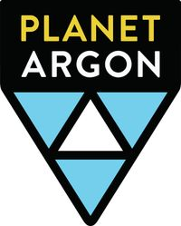

 
# Welcome to Planet Argon!

To view our current open positions, please visit [www.planetargon.com/careers](https://www.planetargon.com/careers)

---

## The Role Interview at Planet Argon

## Why a take-home exercise?
Technical interviews are a pain, no matter how you slice 'em. At Planet Argon, we've experimented with many different formats of tech interviews, from live coding sessions to online quizes, and have found that the best results come from assessments that most mimic the work a person might do on our team. For us, that type of assessment is an asynchronous take-home exercise.

We know that there's a lot of mixed feelings about take-homes, but we think they're the best option for our team currently because:

1. Take-homes exercises allow you to work at your own pace, use your own resources, and generally work as you would an actual member of our development team. We expect you to take no longer than 2 hours to complete the exercise, but you may spend that two hours as you wish to produce the best code you can.
2. Trying to figure out a problem while a small group of people watch you work is excrutiating. Take-home exercises elminate performance anxiety and let you focus on what we're actually asking you to do: produce quality code.
3. As we grow our remote team, async take-home exercises let us judge candidates from different time zones in the same way and by the same criteria.

## How to complete this exercise.
1. Choose an exercise that matches your primary domain: 
    * Frontend
    * Backend
2. Fork the repo of the e
3. blah blah